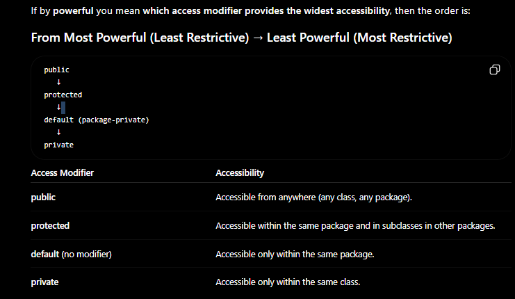

# Java Packages & Access Modifiers

## 1. What are Packages?
A package in Java is a mechanism to encapsulate a group of classes, sub-packages, and interfaces. It is essentially a directory structure that organizes your code.

### Key Advantages
* **Avoiding Naming Conflicts:** Two classes with the same name (e.g., `Date`) can exist if they are in different packages (e.g., `java.util.Date` vs `java.sql.Date`).
* **Access Control:** Packages provide a layer of access control using `protected` and `default` (package-private) modifiers.
* **Reusability:** Packaged code can be imported and reused in other classes or projects.
* **Modularity:** Encourages modular programming by separating functionality into distinct, manageable logical units.

---

## 2. Access Modifiers
Access modifiers determine the scope of a class, constructor, variable, method, or data member.


*(Note: Ensure your image file is inside an 'images' folder in your repo)*

### Quick Reference Table
| Modifier | Class | Package | Subclass (diff pkg) | World (diff pkg) |
| :--- | :---: | :---: | :---: | :---: |
| **public** | Yes | Yes | Yes | Yes |
| **protected** | Yes | Yes | Yes | No |
| **default** (no modifier) | Yes | Yes | No | No |
| **private** | Yes | No | No | No |

---
# Method Overloading in Java

## 📌 1. Overview
**Method Overloading** allows a class to have multiple methods with the **same name** but **different parameter lists** (different signature).

* **Type of Polymorphism:** Compile-time Polymorphism (Static Binding).
* **Goal:** It increases the readability of the program.
    * *Analogy:* Think of a "Search" function on a website. You can search by `keyword` (String), by `date` (Date object), or by `price` (int). The action is always "Search," but the input differs.


---

## ⚙️ 2. The Rules (How to Overload)
A method is overloaded if the **Method Signature** is modified. You can do this in **3 ways**:

### A. Changing the Number of Parameters
```java
class MathUtils {
    // Method 1: Two parameters
    public int add(int a, int b) {
        return a + b;
    }

    // Method 2: Three parameters
    public int add(int a, int b, int c) {
        return a + b + c;
    }
}

class MathUtils {
    // Method 1: Integer type
    public int multiply(int a, int b) {
        return a * b;
    }

    // Method 2: Double type
    public double multiply(double a, double b) {
        return a * b;
    }
}

class User {
    // Order: String, int
    public void display(String name, int id) {
        System.out.println("Name: " + name + ", ID: " + id);
    }

    // Order: int, String
    public void display(int id, String name) {
        System.out.println("ID: " + id + ", Name: " + name);
    }
}
```
Q1: Can we overload by changing ONLY the return type?
Answer: NO. The compiler determines which method to call based on the parameters passed. If only the return type is different, the compiler cannot decide which method to link to.

Java
class Test {
    public int foo() { return 10; }
    
    // ❌ COMPILE ERROR: method foo() is already defined
    // public double foo() { return 10.0; } 
}

Q2: Can we overload the main method?
Answer: YES. You can have multiple main methods. However, the JVM will only look for public static void main(String[] args) to start the program. You must call the other overloaded main methods manually.

Java
public class Main {
public static void main(String[] args) {
System.out.println("Standard Main");
main(10); // Calling overloaded version
}

    public static void main(int a) {
        System.out.println("Overloaded Main: " + a);
    }
}

Q3: What is "Ambiguity Error"?This happens when Type Promotion confuses the compiler.
```
Javaclass Test {
void sum(int a, long b) { ... }
void sum(long a, int b) { ... }

    public static void main(String[] args) {
        Test t = new Test();
        // t.sum(20, 20); // ❌ ERROR: Ambiguous!
        // Because 20 is int. Java doesn't know if it should 
        // promote the second 20 to long (Method 1) 
        // or the first 20 to long (Method 2).
    }
}
```
## ⚡ Summary Cheat Sheet

| Scenario | Allowed? |
| :--- | :---: |
| Changing **Number** of Args | ✅ Yes |
| Changing **Type** of Args | ✅ Yes |
| Changing **Order** of Args | ✅ Yes |
| Changing **Only Return Type** | ❌ No |
| Changing **Only Access Modifier** | ❌ No |
| Overloading `static` methods | ✅ Yes |
| Overloading `main` method | ✅ Yes |


# Dynamic Polymorphism (Method Overriding)

## 📌 Overview
**Dynamic Polymorphism** (also known as Runtime Polymorphism or Dynamic Method Dispatch) is a process in which a call to an overridden method is resolved at **runtime** rather than compile-time.

* **Mechanism:** Method Overriding.
* **Key Condition:** Must happen between two classes with an **IS-A relationship** (Inheritance).
* **Definition:** When a Child class provides a specific implementation of a method that is already provided by its Parent class.


---

## ⚙️ How it Works (The "Magic")
The type of the **Object** (not the type of the Reference Variable) determines which version of the method is executed.

```java
// Parent Class
class Animal {
    void sound() {
        System.out.println("Animal makes a sound");
    }
}

// Child Class
class Dog extends Animal {
    @Override
    void sound() {
        System.out.println("Dog barks");
    }
}

public class Main {
    public static void main(String[] args) {
        // 1. Reference is Animal, Object is Dog
        Animal obj = new Dog(); 
        
        // 2. JVM checks the actual object (Dog) at runtime
        obj.sound(); 
        
        // Output: "Dog barks"
    }
}

```
# Rules for Method Overriding in Java

## 📏 Rules for Overriding
1.  **Same Signature:** The method name and parameter list must be **exactly the same**.
2.  **Inheritance:** It must happen between a **Superclass** and a **Subclass** (IS-A relationship).
3.  **Access Modifier:** The overriding method (child) **cannot be more restrictive** than the overridden method (parent).
    * *Parent:* `protected` → *Child:* `public` (✅ Allowed - Expanded access)
    * *Parent:* `public` → *Child:* `protected` (❌ Error - Restricted access)
4.  **Return Type:** Must be the same or a **Covariant Type** (a subclass of the original return type).
5.  **No Overriding:** You cannot override `final`, `static`, or `private` methods.


---

## ⚠️ Important Interview Concepts

### 1. Can we override Static methods?
**No.**
Static methods are bound to the **class**, not the object. If you define a static method with the same signature in the child class, it is called **Method Hiding**, not overriding.

### 2. Can we override the Constructor?
**No.**
Constructors must have the same name as the class. Since the child class has a different name than the parent class, constructors cannot be overridden.

### 3. The `@Override` Annotation
It is best practice to always use `@Override` above the method in the child class.
* **Why?** It tells the compiler to check the signature. If you make a typo (e.g., `sounnd()` instead of `sound()`), the compiler will throw an error immediately instead of treating it as a new method.

---

## 🆚 Overloading vs Overriding

| Feature | Method Overloading | Method Overriding |
| :--- | :--- | :--- |
| **Type** | Compile-time Polymorphism (Static) | Runtime Polymorphism (Dynamic) |
| **Location** | Same Class | Parent & Child Classes |
| **Method Signature** | Must be **Different** | Must be **Same** |
| **Return Type** | Can change | Must be same (or covariant) |
| **Private/Static** | Can be overloaded | **Cannot** be overridden |
| **Focus** | Readability | Changing Behavior |

# Abstract Keyword in Java

## 📌 Overview
The `abstract` keyword is a non-access modifier used for classes and methods:
* **Abstract Class:** A restricted class that cannot be used to create objects (to access it, it must be inherited from another class).
* **Abstract Method:** A method that consists of a signature and no body (implementation). The body is provided by the subclass.

> **Analogy:** Think of an **Abstract Class** like a "Template" or a "Blue Print." A `Car` blueprint defines that every car must have an engine and wheels, but it doesn't build the car itself. You need a concrete class like `Ferrari` or `Toyota` to build it.

[Image of abstract class vs concrete class diagram]

---

## 🏗 1. Abstract Class
A class which is declared with the `abstract` keyword.

### Rules:
1.  **Instantiation:** It **cannot be instantiated** (you cannot do `new AbstractClass()`).
2.  **Constructors:** It **can have constructors** and static methods.
3.  **Methods:** It can have both **abstract** (methods without body) and **concrete** (methods with body) methods.
4.  **Final:** It **cannot be `final`** (because it must be inherited).

```java
abstract class Vehicle {
    // Constructor
    Vehicle() {
        System.out.println("Vehicle is created");
    }

    // Abstract method (no body)
    abstract void run();

    // Concrete method (has body)
    void changeGear() {
        System.out.println("Gear changed");
    }
}