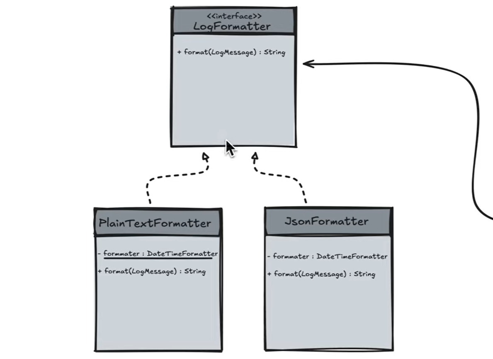
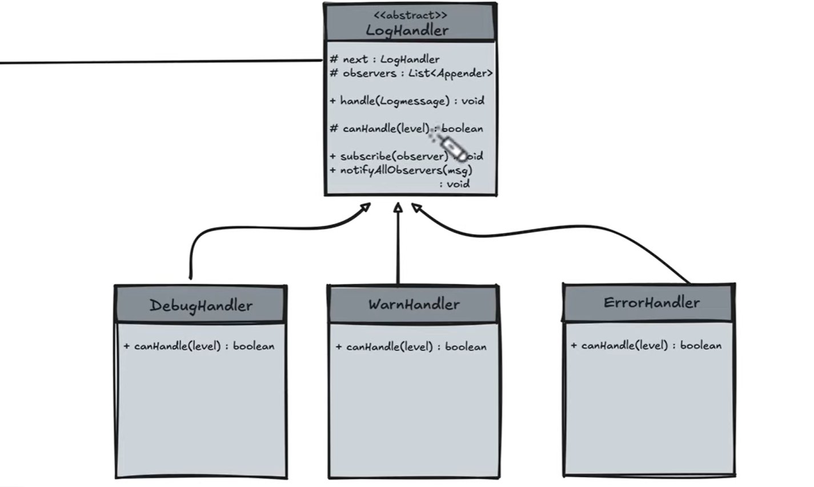
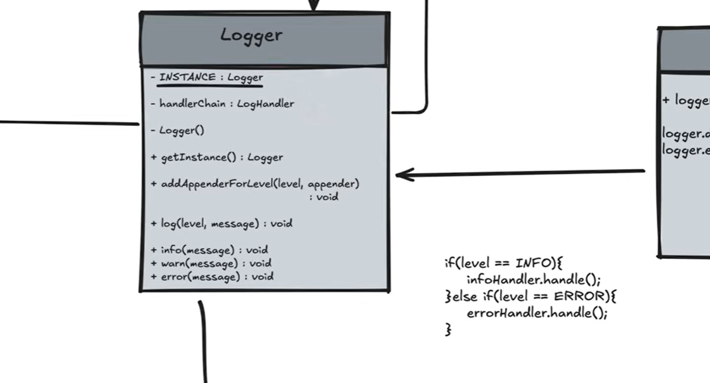
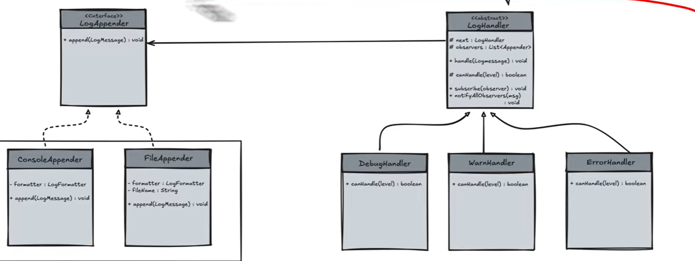
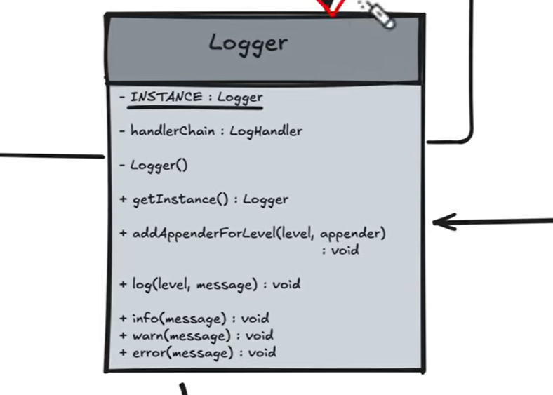
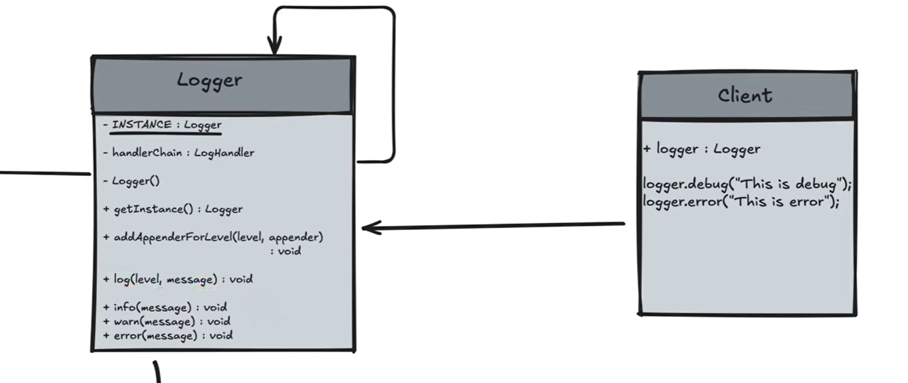
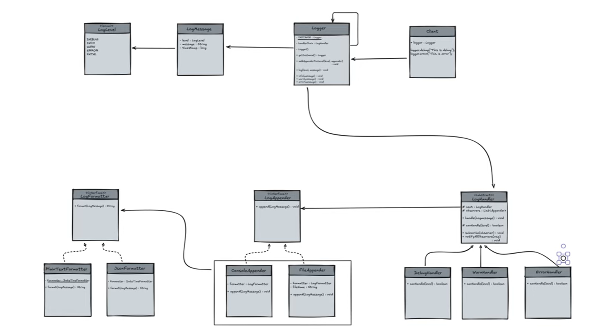

Log Formatter - Strategy design pattern  

LogHandler - Chain of responsibility design pattern (LinkedList)  

if we not use chain of responsibility then we have to use this if else conditions  
which are against the system design laws.  

## Observer design pattern
error handler log - will printed in both console and File  
but DebugHandler will only be printed in console.  

# Singleton design pattern -
Logger class  

Working and entire diagram of Logger:  
